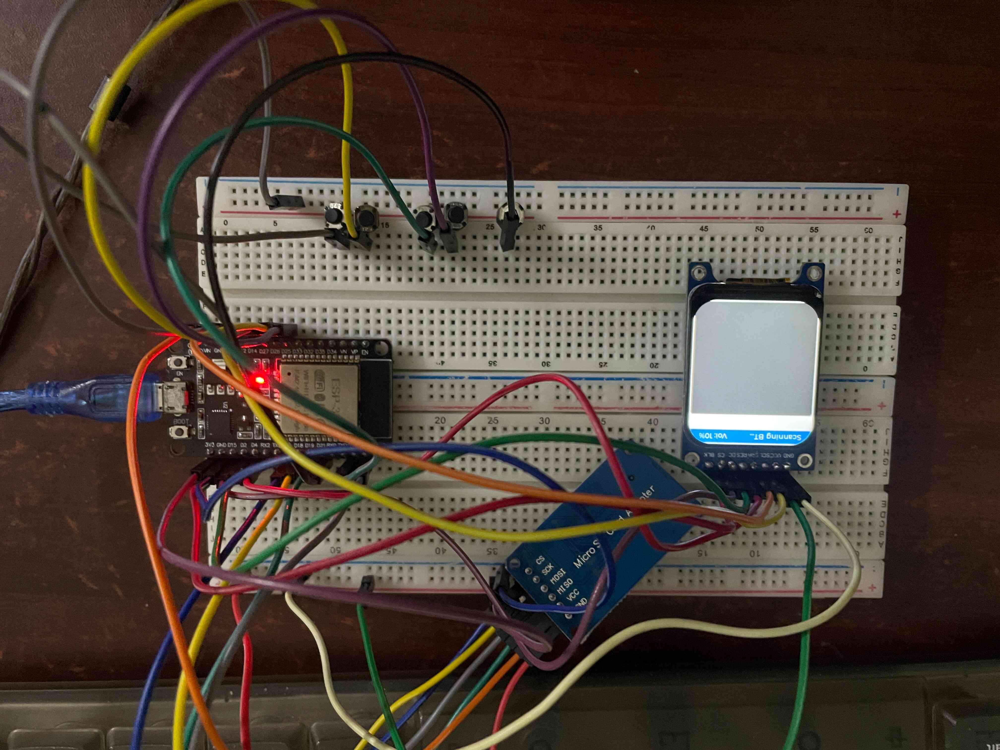
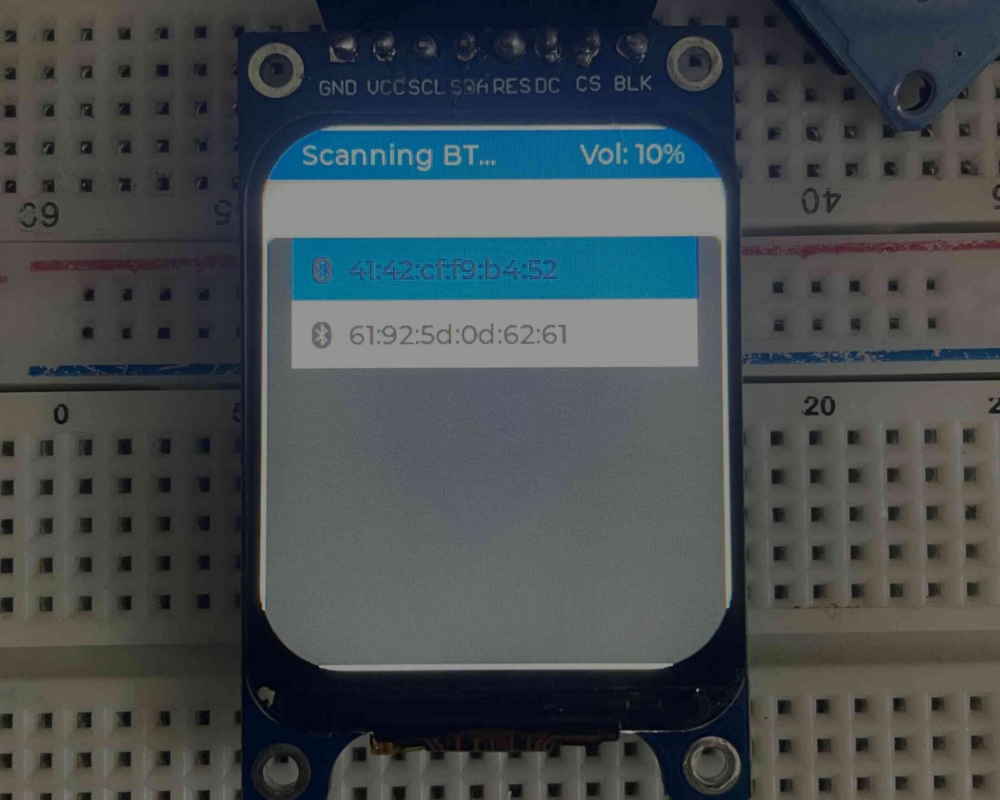
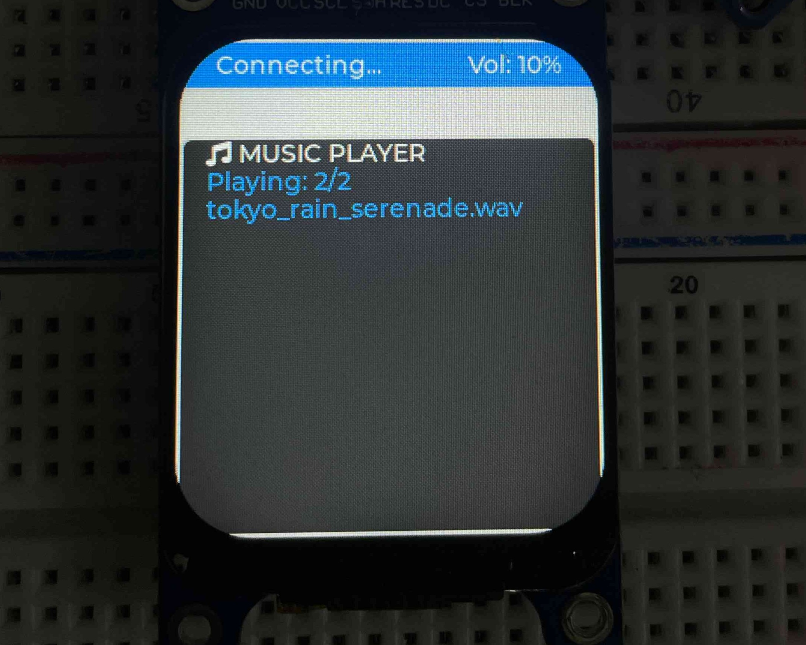

# ESP32 FreeRTOS A2DP Bluetooth Audio Streamer

An embedded, dual-core audio streaming player engineered on an ESP32 using the ESP-IDF framework. This system reads uncompressed `.wav` audio tracks from an SD card, buffers them in internal SRAM via a dedicated FreeRTOS Stream Buffer to prevent pipeline starvation, and streams real-time PCM audio over Bluetooth A2DP to external speakers. It includes an interactive GUI built with LVGL on an ST7789 SPI TFT display with dynamic Bluetooth scanning, selection, and unified hardware button controls.

---

## Hardware Overview

  
*Complete breadboard prototype showing ESP32 DevKit V1, ST7789 TFT display, MicroSD breakout, and control buttons.*

### Materials
* **MCU:** ESP32 DevKit V1 (Dual-core, 240 MHz)
* **Display:** 1.69" ST7789V TFT LCD (240x280 resolution, SPI interface)
* **Storage:** MicroSD Card Module Breakout (SPI interface)
* **User Input:** 5x Tactile Push Buttons (Active-Low with internal pull-ups)
* **Sink Device:** Any standard A2DP compliant Bluetooth speaker or headphones

---

## Pinout & Wiring


| Peripheral | Signal | ESP32 GPIO | Notes |
| :--- | :--- | :--- | :--- |
| **MicroSD Module** | MISO | GPIO 19 | SPI3 (VSPI) Host |
| | MOSI | GPIO 23 | SPI3 (VSPI) Host |
| | SCK / CLK | GPIO 18 | SPI3 (VSPI) Host |
| | CS | GPIO 5 | Chip Select (Active Low) |
| **ST7789 TFT Display** | MOSI (SDA) | GPIO 13 | SPI2 (HSPI) Host |
| | SCLK (SCL) | GPIO 14 | SPI2 (HSPI) Host |
| | CS | GPIO 15 | Chip Select (Active Low) |
| | DC | GPIO 2 | Data / Command Select |
| | RST | GPIO 4 | Hardware Reset |
| **Push Buttons** | PLAY / PAUSE / SELECT | GPIO 21 | Active-Low (Internal Pull-Up) |
| | NEXT / NAV DOWN | GPIO 22 | Active-Low (Internal Pull-Up) |
| | PREV / NAV UP | GPIO 25 | Active-Low (Internal Pull-Up) |
| | VOL UP | GPIO 26 | Active-Low (Internal Pull-Up) |
| | VOL DOWN | GPIO 27 | Active-Low (Internal Pull-Up) |

---

## Graphical User Interface (LVGL)

<table>
  <tr>
    <td><b>Bluetooth scanning phase</b></td>
    <td><b>Music playing phase</b></td>
  </tr>
  <tr>
    <td></td>
    <td></td>
  </tr>
</table>  
*Real-time Bluetooth discovery menu and playback status rendered with LVGL.*

The user interface operates as a dual-state machine:

1. **State 1: Bluetooth Discovery (`STATE_SCANNING`)**
   * Automatically executes GAP general inquiry discovery.
   * Dynamically appends nearby Bluetooth devices to an interactive LVGL list.
   * Translates broadcasted device names or raw BDAs (MAC addresses) into navigable list items.
   * `NEXT` and `PREV` navigate the focus highlight across available devices; `PLAY` confirms selection and triggers connection.

2. **State 2: Music Player (`STATE_MUSIC_PLAYER`)**
   * Renders playback status (`Playing: X/Y`, `Paused`), track filename, and real-time digital volume (`Vol: %`).
   * `NEXT` / `PREV` skips tracks forward and backward across the loaded SD playlist.
   * `PLAY` toggles between A2DP media suspend and resume.

---

## Software Architecture & Concurrency

The firmware leverages FreeRTOS tasks and queues across both ESP32 cores to maintain thread safety:

```
[ MicroSD Card (FATFS) ]
           │
           │  fread() [audio_reader_task (Core 1, Priority 5)]
           ▼
[ FreeRTOS Stream Buffer (32KB SRAM) ]
           │
           │  xStreamBufferReceive()
           ▼
[ bt_app_a2d_data_cb ] ───(PCM Data)───► [ Bluedroid A2DP Stack (Core 0) ] ───► Bluetooth Radio

[ GPIO ISRs ] ───► [ button_queue ] ───► [ button_task ] ───► LVGL Thread / State Controller
```

### FreeRTOS Stream Buffer & RAM Allocation
Direct file reads from the MicroSD card during the Bluetooth audio callback (`bt_app_a2d_data_cb`) cause buffer underruns due to SPI read latency on breadboards, producing stuttering audio. 

To solve this, the firmware uses a dedicated RTOS background task (`audio_reader_task`) that operates independently of the Bluetooth stack. This task constantly reads 2KB chunks from the SD card and pre-loads them into a 32KB FreeRTOS Stream Buffer located in the ESP32's fast internal SRAM. 

Instead of waiting for the slow SD card SPI bus, the Bluedroid A2DP interrupt callback instantly pulls the required audio frames directly from this high-speed RAM buffer. As the Bluetooth stack consumes data, the RTOS task automatically wakes up and refills the RAM, ensuring a seamless, continuous flow of audio.

---

## User-Configurable Parameters

Key runtime and compilation constants can be modified at the top of `main/main.c`:

* **`MAX_TRACKS` (Default: `20`):** Sets the maximum number of tracks loaded into the playlist array. Each track requires exactly 192 bytes of static RAM to store its filepath and display name. Since the ESP32 has roughly 300KB of usable free SRAM, you can safely increase this limit to hold 100-200 songs (consuming ~19KB to ~38KB of RAM) without starving the FreeRTOS heap or causing instability.
* **`host.max_freq_khz` (Default: `10000` [10 MHz]):** SD SPI clock frequency. For breadboard builds with loose jumper wires, keep this between `5000` and `10000` kHz to prevent signal degradation. On a routed PCB, this can safely be increased up to `20000` kHz (20 MHz). 
* **`audio_stream_buf` Size (Default: `32 * 1024` [32 KB]):** Capacity of the audio stream buffer in RAM. Adjust based on available heap.
* **Digital Volume Steps:** Volume increments/decrements in 5% steps inside `button_task`.

---

## Audio Format Requirements & Limitations

* **Supported Audio Format:** Uncompressed **16-bit PCM WAV**, **44.1 kHz**, **Stereo**.
* **Header Handling:** The firmware offsets 44 bytes on file open to skip standard canonical RIFF headers.
* **MP3 Files:** Standard ESP-IDF Bluedroid A2DP source pipes raw PCM buffers to the SBC encoder. Compressed `.mp3` files lack native hardware decoding; while the SD scanner lists `.mp3` files, playing them activates a synthetic 440 Hz square-wave fallback tone to protect connected speakers from raw-byte noise.
* **Bluetooth Device Discovery:** Devices that conceal their Local Name in initial GAP inquiry packets will display their BD-ADDR (`XX:XX:XX:XX:XX:XX`) on the LVGL menu. Selecting the MAC entry connects normally.

---

## Getting Started

### Prerequisites
* ESP-IDF (v5.x or v6.x) installed and configured in your environment path.
* MicroSD card formatted to **FAT32** with `.wav` audio files stored in the root directory.

### Build and Flash
1. Clone the repository:
   ```bash
   git clone [https://github.com/naikisu/ESP32-A2DP-Streamer.git](https://github.com/naikisu/ESP32-A2DP-Streamer.git)
   cd ESP32-A2DP-Streamer
   ```

2. Set target to ESP32:
   ```bash
   idf.py set-target esp32
   ```

3. Ensure partition table accommodates Bluetooth and LVGL components:
   ```bash
   idf.py menuconfig
   # Partition Table -> Custom partition table CSV -> select partitions.csv (minimum 3MB factory app partition)
   ```

4. Build, flash, and open serial monitor:
   ```bash
   idf.py build flash monitor
   ```

---

## Roadmap
- [x] SPI ST7789 display driver integration via `esp_lcd`
- [x] Dual-mode Bluetooth discovery and A2DP source streaming
- [x] FreeRTOS Stream Buffer architecture to resolve SPI buffer underruns
- [x] Context-aware unified 5-button control state machine
- [ ] Direct MP3 decoding using the `minimp3` software decoding library
- [ ] Transition breadboard wiring to a custom 2-layer PCB designed in KiCad
- [ ] Non-Volatile Storage (NVS) caching for persistent volume and paired speaker profiles
